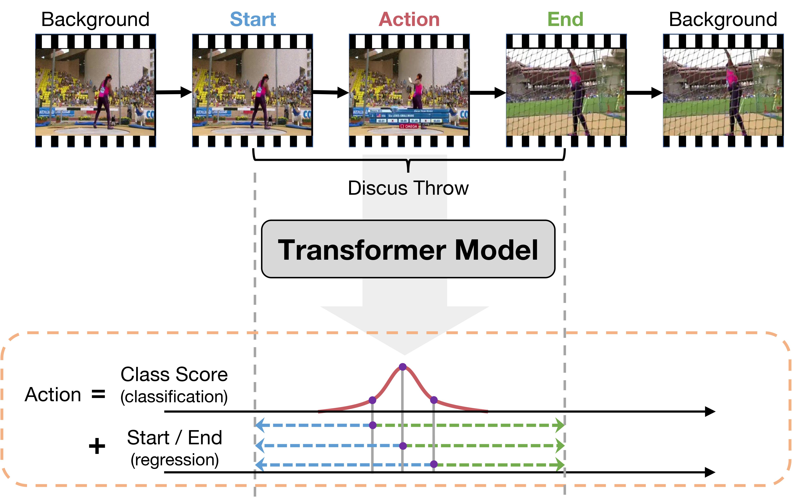

# ActionFormer: Localizing Moments of Actions with Transformers

## Introduction
This code repo implements Actionformer, one of the first Transformer-based model for temporal action localization --- detecting the onsets and offsets of action instances and recognizing their action categories. Without bells and whistles, ActionFormer achieves ~~65.6%~~ 71.0% mAP at tIoU=0.5 on THUMOS14, outperforming the best prior model by ~~8.7~~ 14.1 absolute percentage points and crossing the 60% mAP for the first time. Further, ActionFormer demonstrates strong results on ActivityNet 1.3 (36.0% average mAP) and the more challenging EPIC-Kitchens 100 (+13.5% average mAP over prior works). An earlier version of our tech report can be found in [this link](https://arxiv.org/abs/2202.07925). We invite our audience to try out the code.

<div align="center">
  
</div>

Specifically, we adopt a minimalist design and develop a Transformer based model for temporal action localization, inspired by the recent success of Transformers in NLP and vision. Our method, illustrated in the figure, adapts local self-attention to model temporal context in untrimmed videos, classifies every moment in an input video, and regresses their corresponding action boundaries. The result is a deep model that is trained using standard classification and regression loss, and can localize moments of actions in a single shot, without using action proposals or pre-defined anchor windows.

## Changelog
* 05/09/2022: Pre-trained models have been updated.

* 05/08/2022: We have updated the code repo based on the community feedback and our code review, leading to significantly better average mAP on THUMOS14 (>66.0%) and slightly improved results on ActivityNet and EPIC-Kitchens 100. We will update ~~the pre-trained models and~~ the tech report shortly.


## Code Overview
The structure of this code repo is heavily inspired by Detectron2. Some of the main components are
* ./libs/core: Parameter configuration module.
* ./libs/datasets: Data loader and IO module.
* ./libs/modeling: Our main model with all its building blocks.
* ./libs/utils: Utility functions for training, inference, and postprocessing.

## Installation
* Follow INSTALL.md for installing necessary dependencies and compiling the code.

## Frequently Asked Questions
* See FAQ.md.


## To Reproduce Our Results on THUMOS14
**Download Features and Annotations**
* Download *thumos.tar.gz* (`md5sum 375f76ffbf7447af1035e694971ec9b2`) from [this Box link](https://uwmadison.box.com/s/glpuxadymf3gd01m1cj6g5c3bn39qbgr) or [this Google Drive link](https://drive.google.com/file/d/1zt2eoldshf99vJMDuu8jqxda55dCyhZP/view?usp=sharing) or [this BaiduYun link](https://pan.baidu.com/s/1TgS91LVV-vzFTgIHl1AEGA?pwd=74eh:).
* The file includes I3D features, action annotations in json format (similar to ActivityNet annotation format), and external classification scores.

**Details**: The features are extracted from two-stream I3D models pretrained on Kinetics using clips of `16 frames` at the video frame rate (`~30 fps`) and a stride of `4 frames`. This gives one feature vector per `4/30 ~= 0.1333` seconds.

**Unpack Features and Annotations**
* Unpack the file under *./data* (or elsewhere and link to *./data*).
* The folder structure should look like
```
This folder
│   README.md
│   ...  
│
└───data/
│    └───thumos/
│    │	 └───annotations
│    │	 └───i3d_features   
│    └───...
|
└───libs
│
│   ...
```

**Training and Evaluation**
* Train our ActionFormer with I3D features. This will create a experiment folder under *./ckpt* that stores training config, logs, and checkpoints.
```shell
python ./train.py ./configs/thumos_i3d.yaml --output reproduce
```
* [Optional] Monitor the training using TensorBoard
```shell
tensorboard --logdir=./ckpt/thumos_i3d_reproduce/logs
```
* Evaluate the trained model. The expected average mAP should be around 62.6(%) as in Table 1 of our main paper. **With recent commits, the expected average mAP should be higher than 66.0(%)**.
```shell
python ./eval.py ./configs/thumos_i3d.yaml ./ckpt/thumos_i3d_reproduce
```
* Training our model on THUMOS requires ~4.5GB GPU memory, yet the inference might require over 10GB GPU memory. We recommend using a GPU with at least 12 GB of memory.

**[Optional] Evaluating Our Pre-trained Model**

We also provide a pre-trained model for THUMOS 14. The model with all training logs can be downloaded from [this Google Drive link](https://drive.google.com/file/d/1isG3bc1dG5-llBRFCivJwz_7c_b0XDcY/view?usp=sharing). To evaluate the pre-trained model, please follow the steps listed below.

* Create a folder *./pretrained* and unpack the file under *./pretrained* (or elsewhere and link to *./pretrained*).
* The folder structure should look like
```
This folder
│   README.md
│   ...  
│
└───pretrained/
│    └───thumos_i3d_reproduce/
│    │	 └───thumos_reproduce_log.txt
│    │	 └───thumos_reproduce_results.txt
│    │   └───...    
│    └───...
|
└───libs
│
│   ...
```
* The training config is recorded in *./pretrained/thumos_i3d_reproduce/config.txt*.
* The training log is located at *./pretrained/thumos_i3d_reproduce/thumos_reproduce_log.txt* and also *./pretrained/thumos_i3d_reproduce/logs*.
* The pre-trained model is *./pretrained/thumos_i3d_reproduce/epoch_034.pth.tar*.
* Evaluate the pre-trained model.
```shell
python ./eval.py ./configs/thumos_i3d.yaml ./pretrained/thumos_i3d_reproduce/
```
* The results (mAP at tIoUs) should be

| Method            |  0.3  |  0.4  |  0.5  |  0.6  |  0.7  |  Avg  |
|-------------------|-------|-------|-------|-------|-------|-------|
| ActionFormer      | 82.13 | 77.80 | 70.95 | 59.40 | 43.87 | 66.83 |


## To Reproduce Our Results on ActivityNet 1.3
**Download Features and Annotations**
* Download *anet_1.3.tar.gz* (`md5sum c415f50120b9425ee1ede9ac3ce11203`) from [this Box link](https://uwmadison.box.com/s/aisdoymowukc99zoc7gpqegxbb4whikx) or [this Google Drive Link](https://drive.google.com/file/d/1VW8px1Nz9A17i0wMVUfxh6YsPCLVqL-S/view?usp=sharing) or [this BaiduYun Link](https://pan.baidu.com/s/1tw5W8B5YqDvfl-mrlWQvnQ?pwd=xuit:).
* The file includes TSP features, action annotations in json format (similar to ActivityNet annotation format), and external classification scores.

**Details**: The features are extracted from the R(2+1)D-34 model pretrained with TSP on ActivityNet using clips of `16 frames` at a frame rate of `15 fps` and a stride of `16 frames` (*i.e.,* **non-overlapping** clips). This gives one feature vector per `16/15 ~= 1.067` seconds. The features are converted into numpy files for our code.

**Unpack Features and Annotations**
* Unpack the file under *./data* (or elsewhere and link to *./data*).
* The folder structure should look like
```
This folder
│   README.md
│   ...  
│
└───data/
│    └───anet_1.3/
│    │	 └───annotations
│    │	 └───tsp_features   
│    └───...
|
└───libs
│
│   ...
```

**Training and Evaluation**
* Train our ActionFormer with TSP features. This will create a experiment folder under *./ckpt* that stores training config, logs, and checkpoints.
```shell
python ./train.py ./configs/anet_tsp.yaml --output reproduce
```
* [Optional] Monitor the training using TensorBoard
```shell
tensorboard --logdir=./ckpt/anet_tsp_reproduce/logs
```
* Evaluate the trained model. The expected average mAP should be around 36.0(%) as in Table 1 of our main paper.
```shell
python ./eval.py ./configs/anet_tsp.yaml ./ckpt/anet_tsp_reproduce
```
* Training our model on ActivityNet requires ~4.6GB GPU memory, yet the inference might require over 10GB GPU memory. We recommend using a GPU with at least 12 GB of memory.

**[Optional] Evaluating Our Pre-trained Model**

We also provide a pre-trained model for ActivityNet 1.3. The model with all training logs can be downloaded from [this Google Drive link](https://drive.google.com/file/d/1UgWGXeTTPQn_tnw92aB2VF08bqak7j-W/view?usp=sharing). To evaluate the pre-trained model, please follow the steps listed below.

* Create a folder *./pretrained* and unpack the file under *./pretrained* (or elsewhere and link to *./pretrained*).
* The folder structure should look like
```
This folder
│   README.md
│   ...  
│
└───pretrained/
│    └───anet_tsp_reproduce/
│    │	 └───anet_tsp_reproduce_log.txt
│    │	 └───anet_tsp_reproduce_results.txt
│    │   └───...    
│    └───...
|
└───libs
│
│   ...
```
* The training config is recorded in *./pretrained/anet_tsp_reproduce/config.txt*.
* The training log is located at *./pretrained/anet_tsp_reproduce/anet_tsp_reproduce_log.txt* and also *./pretrained/anet_tsp_reproduce/logs*.
* The pre-trained model is *./pretrained/anet_tsp_reproduce/epoch_014.pth.tar*.
* Evaluate the pre-trained model.
```shell
python ./eval.py ./configs/anet_tsp.yaml ./pretrained/anet_tsp_reproduce/
```
* The results (mAP at tIoUs) should be

| Method            |  0.5  |  0.75 |  0.95 |  Avg  |
|-------------------|-------|-------|-------|-------|
| ActionFormer      | 54.34 | 37.22 |  7.79 | 36.06 |


## To Reproduce Our Results on EPIC Kitchens 100
**Download Features and Annotations**
* Download *epic_kitchens.tar.gz* (`md5sum add9803756afd9a023bc9a9c547e0229`) from [this Box link](https://uwmadison.box.com/s/vdha47qnce6jhqktz9g4mq1gc40w82yj) or [this Google Drive Link](https://drive.google.com/file/d/1Z4U_dLuu6_cV5NBIrSzsSDOOj2Uar85X/view?usp=sharing) or [this BaiduYun Link](https://pan.baidu.com/s/15tOdX6Yp4AJ9lFGjbQ8dgg?pwd=f3tx:).
* The file includes SlowFast features as well as action annotations in json format (similar to ActivityNet annotation format).

**Details**: The features are extracted from the SlowFast model pretrained on the training set of EPIC Kitchens 100 (action classification) using clips of `32 frames` at a frame rate of `30 fps` and a stride of `16 frames`. This gives one feature vector per `16/30 ~= 0.5333` seconds.

**Unpack Features and Annotations**
* Unpack the file under *./data* (or elsewhere and link to *./data*).
* The folder structure should look like
```
This folder
│   README.md
│   ...  
│
└───data/
│    └───epic_kitchens/
│    │	 └───annotations
│    │	 └───features   
│    └───...
|
└───libs
│
│   ...
```

**Training and Evaluation**
* On EPIC Kitchens, we train separate models for nouns and verbs.
* To train our ActionFormer on verbs with SlowFast features, use
```shell
python ./train.py ./configs/epic_slowfast_verb.yaml --output reproduce
```
* To train our ActionFormer on nouns with SlowFast features, use
```shell
python ./train.py ./configs/epic_slowfast_noun.yaml --output reproduce
```
* Evaluate the trained model for verbs. The expected average mAP should be around 23.4(%) as in Table 2 of our main paper.
```shell
python ./eval.py ./configs/epic_slowfast_verb.yaml ./ckpt/epic_slowfast_verb_reproduce
```
* Evaluate the trained model for nouns. The expected average mAP should be around 21.9(%) as in Table 2 of our main paper.
```shell
python ./eval.py ./configs/epic_slowfast_noun.yaml ./ckpt/epic_slowfast_noun_reproduce
```
* Training our model on EPIC Kitchens requires ~4.5GB GPU memory, yet the inference might require over 10GB GPU memory. We recommend using a GPU with at least 12 GB of memory.

**[Optional] Evaluating Our Pre-trained Model**

We also provide a pre-trained model for EPIC-Kitchens 100. The model with all training logs can be downloaded from [this Google Drive link](https://drive.google.com/file/d/1Ta4ggKSj2YcszSrDbePlHe1ECF1CFKK4/view?usp=sharing) (verb), and from this [Google Drive link](https://drive.google.com/file/d/1OTlxeiWj8JE9n1-LsRYogHmqgUdsE5PR/view?usp=sharing) (noun). To evaluate the pre-trained model, please follow the steps listed below.

* Create a folder *./pretrained* and unpack the file under *./pretrained* (or elsewhere and link to *./pretrained*).
* The folder structure should look like
```
This folder
│   README.md
│   ...  
│
└───pretrained/
│    └───epic_slowfast_verb_reproduce/
│    │	 └───epic_slowfast_verb_reproduce_log.txt
│    │	 └───epic_slowfast_verb_reproduce_results.txt
│    │   └───...   
│    └───epic_slowfast_noun_reproduce/
│    │	 └───epic_slowfast_noun_reproduce_log.txt
│    │	 └───epic_slowfast_noun_reproduce_results.txt
│    │   └───...  
│    └───...
|
└───libs
│
│   ...
```
* The training config is recorded in *./pretrained/epic_slowfast_(verb|noun)_reproduce/config.txt*.
* The training log is located at *./pretrained/epic_slowfast_(verb|noun)_reproduce/epic_slowfast_(verb|noun)_reproduce_log.txt* and also *./pretrained/epic_slowfast_(verb|noun)_reproduce/logs*.
* The pre-trained model is *./pretrained/epic_slowfast_(verb|noun)_reproduce/epoch_(020|020).pth.tar*.
* Evaluate the pre-trained model for verbs.
```shell
python ./eval.py ./configs/epic_slowfast_verb.yaml ./pretrained/epic_slowfast_verb_reproduce/
```
* Evaluate the pre-trained model for nouns.
```shell
python ./eval.py ./configs/epic_slowfast_noun.yaml ./pretrained/epic_slowfast_noun_reproduce/
```
* The results (mAP at tIoUs) should be

| Method              |  0.1  |  0.2  |  0.3  |  0.4  |  0.5  |  Avg  |
|---------------------|-------|-------|-------|-------|-------|-------|
| ActionFormer (verb) | 26.58 | 25.42 | 24.15 | 22.29 | 19.09 | 23.51 |
| ActionFormer (noun) | 25.21 | 24.11 | 22.66 | 20.47 | 16.97 | 21.88 |


## Training and Evaluating Your Own Dataset
Work in progress. Stay tuned.

## Contact
Yin Li (yin.li@wisc.edu)

## References
If you are using our code, please consider citing our paper.
```
@article{zhang2022actionformer,
  title={ActionFormer: Localizing Moments of Actions with Transformers},
  author={Zhang, Chenlin and Wu, Jianxin and Li, Yin},
  journal={arXiv preprint arXiv:2202.07925},
  year={2022}
}
```

If you are using TSP features, please cite
```
@inproceedings{alwassel2021tsp,
  title={{TSP}: Temporally-sensitive pretraining of video encoders for localization tasks},
  author={Alwassel, Humam and Giancola, Silvio and Ghanem, Bernard},
  booktitle={Proceedings of the IEEE/CVF International Conference on Computer Vision Workshops},
  pages={3173--3183},
  year={2021}
}
```
